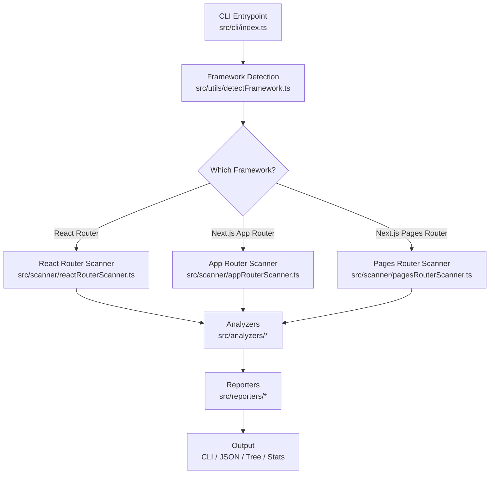

<div align="center">
  <!-- Custom Shield Logo -->
  <svg width="200" height="200" viewBox="0 0 200 200" fill="none" xmlns="http://www.w3.org/2000/svg">
    <path d="M100 20 L170 45 L170 90 C170 130 140 160 100 180 C60 160 30 130 30 90 L30 45 Z" fill="#2563eb" stroke="#1e40af"/>
    <text x="100" y="115" text-anchor="middle" fill="white" font-family="Arial" font-weight="bold" font-size="48">RL</text>
  </svg>

  <h1>RouteLens</h1>
  <h3>Static Analysis Tool for React & Next.js Routing Issues</h3>
  <p>Catch broken links, duplicate routes, invalid syntax, and more — before they hit production!</p>

  <div>
    
    
    
  </div>
</div>

---

## Table of Contents
- [Why RouteLens?](#why-routelens)
- [Features](#features)
- [Architecture Overview](#architecture-overview)
- [Getting Started](#getting-started)
- [Usage](#usage)
- [CI/CD Integration](#cicd-integration)
- [Contributing](#contributing)
- [Roadmap](#roadmap)
- [License](#license)

---

## Why RouteLens?
Routing issues are one of the most common causes of bad UX, 404 errors, and SEO problems in React/Next.js apps. RouteLens uses **static analysis** to catch these issues early in your development workflow — no runtime required!

### Common Issues Detected
- 😱 Broken internal links
- ⚠️ Duplicate route definitions
- ❌ Invalid dynamic route syntax
- 📂 Missing pages

---

## Features
| Feature | Description |
|---------|-------------|
| 🧠 **Automatic Framework Detection** | Detects React Router, Next.js App Router, and Next.js Pages Router automatically |
| 🔍 **Deep Source Scanning** | Uses `ts-morph` to parse your actual source code, not just filenames |
| 📊 **Multiple Output Formats** | Human-readable CLI, JSON for machines, route tree, and stats summary |
| 📝 **Actionable Feedback** | Every finding includes file path + line number |
| 🚀 **Extensible Architecture** | Easy to add new analyzers and reporters |

---

## Tech Stack
<div align="center">
  
  
  
  
  
  
  
  
  
</div>

---

## Architecture Overview


---

## Getting Started

### Prerequisites
- Node.js 18+
- npm/yarn/pnpm

### Installation
```bash
# Clone the repo
git clone https://github.com/tarunagnihotri534/RouteLens.git
cd RouteLens

# Install dependencies
npm install --no-bin-links

# Build the TypeScript code
npm run build
```

---

## Usage

### Basic Scan
Scan the current directory for routing issues:
```bash
node dist/cli/index.js scan
```

### Scan a Specific Directory
```bash
node dist/cli/index.js scan --path ./my-react-app
```

### Output Options
| Flag | Description |
|------|-------------|
| `--json` | Output machine-readable JSON |
| `--tree` | Show a hierarchical route tree |
| `--stats` | Show only statistics |
| `--path <dir>` | Path to project to scan (default: `.`) |

### Example Output
```
Route Summary:
  /
  /about
  /blog/[slug]

Findings:
  ✗ Broken Route
    /blog/123 does not exist
    at components/Navbar.tsx:12

Statistics:
  Total Routes:      3
  Broken Links:       1
  Duplicate Routes:   0
  Dynamic Routes:     1
  Unused Pages:       0
```

---

## CI/CD Integration

### GitHub Actions
Create a `.github/workflows/routelens.yml` file:
```yaml
name: RouteLens Scan
on: [pull_request]
jobs:
  scan:
    runs-on: ubuntu-latest
    steps:
      - uses: actions/checkout@v4
      - uses: actions/setup-node@v4
        with:
          node-version: 20
      - name: Install RouteLens
        run: npm ci
      - name: Build RouteLens
        run: npm run build
      - name: Run RouteLens Scan
        run: node dist/cli/index.js scan --json > scan-results.json
      # Optional: Add step to parse scan-results.json and fail PR on errors
```

---

## Contributing
Contributions are welcome! Feel free to open issues or submit pull requests!

---

## Roadmap
- [ ] VS Code Extension
- [ ] GitHub Action
- [ ] Support for Remix
- [ ] More analyzers (unused pages, nested route issues)
- [ ] Custom configuration file

---

## License
MIT
