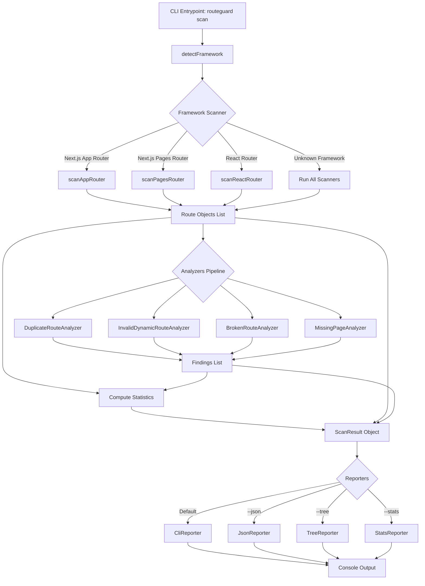
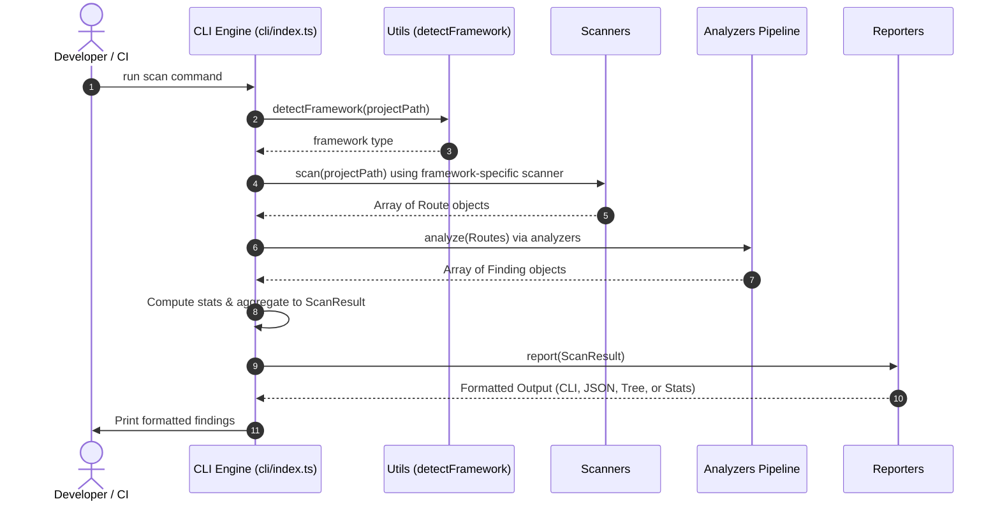
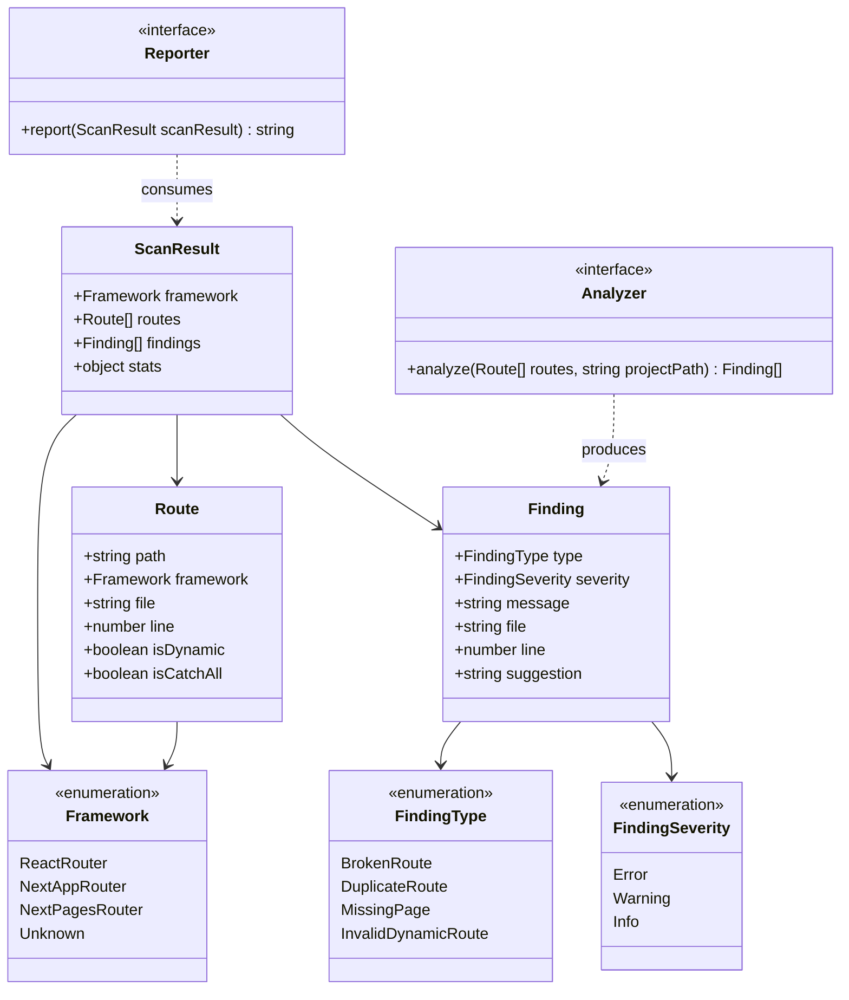

<div align="center">
  
  <h1>RouteLens</h1>
  <p>Static analysis tool to catch React & Next.js routing issues before production</p>

  <div>
    
    
    
    
    
  </div>
</div>

---

## 📖 About RouteLens

**RouteLens** is a static analysis tool designed to audit routing structures in React and Next.js applications. By analyzing your codebase statically, RouteLens catches common configuration issues and structural discrepancies before they impact your production environments.

In modern frontend projects, routes are often declared dynamically or implicitly through page directories, while navigation triggers (like links or programmatic redirects) are scattered throughout components. RouteLens resolves these by scanning the project framework structure, identifying defined pages or routes, and verifying that internal application links point to valid targets. This makes it an ideal fit for developers checking configurations locally or as a test check in CI/CD pipelines.

---

## 🏗️ System Architecture

RouteLens processes target codebases using a linear, modular pipeline: **Framework Detection ➡️ Route Scanning ➡️ Route Analysis ➡️ Output Reporting**.

### Flow Diagrams

#### 1. High-Level Architecture Pipeline


#### 2. Scan Execution Sequence


#### 3. Core Class & Type Definitions


### Core Architecture Components

RouteLens is organized into four modular modules:

1. **Framework Detector**: The [detectFramework](file:///c:/Users/darkt/OneDrive/Documents/Desktop/RouteGuard/src/utils/detectFramework.ts) utility automatically resolves the target project's framework based on `package.json` dependencies (identifying Next.js or React Router) and folder structures (detecting `/app` or `/pages` directories).
2. **Source Scanners**: Parses files to locate routing definitions and compiles them into a uniform `Route` object list:
   - [scanAppRouter](file:///c:/Users/darkt/OneDrive/Documents/Desktop/RouteGuard/src/scanner/appRouterScanner.ts): Scans the Next.js App Router (discovering folders containing `page.ts/tsx/js/jsx` files).
   - [scanPagesRouter](file:///c:/Users/darkt/OneDrive/Documents/Desktop/RouteGuard/src/scanner/pagesRouterScanner.ts): Scans the Next.js Pages Router (indexing endpoints from the `/pages` directory, skipping API files).
   - [scanReactRouter](file:///c:/Users/darkt/OneDrive/Documents/Desktop/RouteGuard/src/scanner/reactRouterScanner.ts): Employs AST-parsing (via `ts-morph`) to identify React Router layouts (like JSX `<Route path="..." />` nodes or `createBrowserRouter` configurations).
3. **Route Analyzers**: Audits the generated route structures to check for common flaws:
   - [DuplicateRouteAnalyzer](file:///c:/Users/darkt/OneDrive/Documents/Desktop/RouteGuard/src/analyzers/duplicateRouteAnalyzer.ts): Checks for route paths defined multiple times.
   - [InvalidDynamicRouteAnalyzer](file:///c:/Users/darkt/OneDrive/Documents/Desktop/RouteGuard/src/analyzers/invalidDynamicRouteAnalyzer.ts): Checks dynamic route definitions for syntax discrepancies.
   - [BrokenRouteAnalyzer](file:///c:/Users/darkt/OneDrive/Documents/Desktop/RouteGuard/src/analyzers/brokenRouteAnalyzer.ts): Parses files using AST to ensure that client-side router navigation links (e.g. `<Link>` tags or `router.push(...)`) match valid routes.
   - [MissingPageAnalyzer](file:///c:/Users/darkt/OneDrive/Documents/Desktop/RouteGuard/src/analyzers/missingPageAnalyzer.ts): Verifies that physical pages exist for all scanned routes.
4. **Reporters**: Formats and displays the scan results:
   - [CliReporter](file:///c:/Users/darkt/OneDrive/Documents/Desktop/RouteGuard/src/reporters/cliReporter.ts): Formats error reports, warnings, and code references directly to standard output.
   - [JsonReporter](file:///c:/Users/darkt/OneDrive/Documents/Desktop/RouteGuard/src/reporters/jsonReporter.ts): Outputs raw JSON of scanning results for CI/CD assertions.
   - [TreeReporter](file:///c:/Users/darkt/OneDrive/Documents/Desktop/RouteGuard/src/reporters/treeReporter.ts): Builds a text-based, hierarchical tree representation of all discovered paths.
   - [StatsReporter](file:///c:/Users/darkt/OneDrive/Documents/Desktop/RouteGuard/src/reporters/statsReporter.ts): Displays summary statistics, including overall counts of unique paths, duplicates, dynamic paths, and broken paths.

---

## 🗂️ Project Directory Structure

Here is a layout of the RouteLens codebase:

* [src/](file:///c:/Users/darkt/OneDrive/Documents/Desktop/RouteGuard/src)
  * [cli/](file:///c:/Users/darkt/OneDrive/Documents/Desktop/RouteGuard/src/cli) — CLI definition and orchestration ([cli/index.ts](file:///c:/Users/darkt/OneDrive/Documents/Desktop/RouteGuard/src/cli/index.ts))
  * [scanner/](file:///c:/Users/darkt/OneDrive/Documents/Desktop/RouteGuard/src/scanner) — Route scanners mapping file paths and AST parameters
  * [analyzers/](file:///c:/Users/darkt/OneDrive/Documents/Desktop/RouteGuard/src/analyzers) — Analyzers evaluating path issues
  * [reporters/](file:///c:/Users/darkt/OneDrive/Documents/Desktop/RouteGuard/src/reporters) — Console and JSON formatting engines
  * [types/](file:///c:/Users/darkt/OneDrive/Documents/Desktop/RouteGuard/src/types) — System models and types ([types/index.ts](file:///c:/Users/darkt/OneDrive/Documents/Desktop/RouteGuard/src/types/index.ts))
  * [utils/](file:///c:/Users/darkt/OneDrive/Documents/Desktop/RouteGuard/src/utils) — Path operations, framework detection, AST helpers, and glob resolvers

---

## ⚡ Key Features

- **🔍 Detect Broken Links**: Identifies internal router references that direct to dead endpoints.
- **⚠️ Find Duplicate Routes**: Detects components or page structures sharing duplicate url destinations.
- **❌ Catch Invalid Dynamic Routing Syntax**: Highlights syntactically invalid route templates.
- **📊 Multiple Output Formats**: CLI details, raw JSON, stats table, or folder route trees.
- **🧠 Automated Detection**: Supports Next.js (App Router / Pages Router) and React Router.

---

## 🚀 Quick Start

### Prerequisites
- Node.js 18+

### Installation & Run

```bash
# Clone the repository
git clone https://github.com/tarunagnihotri534/RouteLens.git
cd RouteLens

# Install dependencies
npm install --no-bin-links

# Compile TypeScript
npm run build

# Run scan on your local workspace/project
node dist/cli/index.js scan --path ./your-project
```

---

## 🛠️ Usage Flags

Configure scanning behavior using CLI options:

| Flag | Shortcut | Description |
|------|----------|-------------|
| `--json` | `-j` | Output scan results as machine-readable JSON |
| `--tree` | `-t` | Render route hierarchy as a visual tree |
| `--stats` | `-s` | Output summary statistics table only |
| `--path <dir>`| `-p` | Path to the target project to analyze (default: `.`) |

### Example Commands

```bash
# Scan the current directory using the CLI output
node dist/cli/index.js scan

# Render the route hierarchy structure of a target application
node dist/cli/index.js scan --path ../my-nextjs-app --tree

# Output JSON reports for pipeline validation checks
node dist/cli/index.js scan --path ../my-react-app --json
```

---

## 📄 License
This project is licensed under the MIT License.
